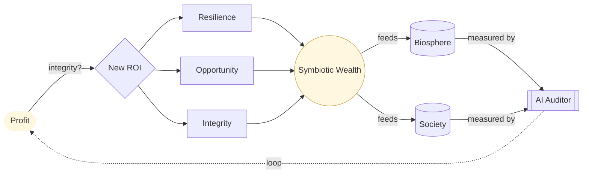

# Part I — Prosperity and Purpose · Diagram

*Loops profit → ROI (resilience / opportunity / integrity) → symbiotic wealth → biosphere & society → AI auditor → back to profit.* Anchored to [Chapter 1](../../../PROMPT_ATLAS.md#ch1-profits-with-integrity) and [Chapter 2](../../../PROMPT_ATLAS.md#ch2-economics-as-ecology).
