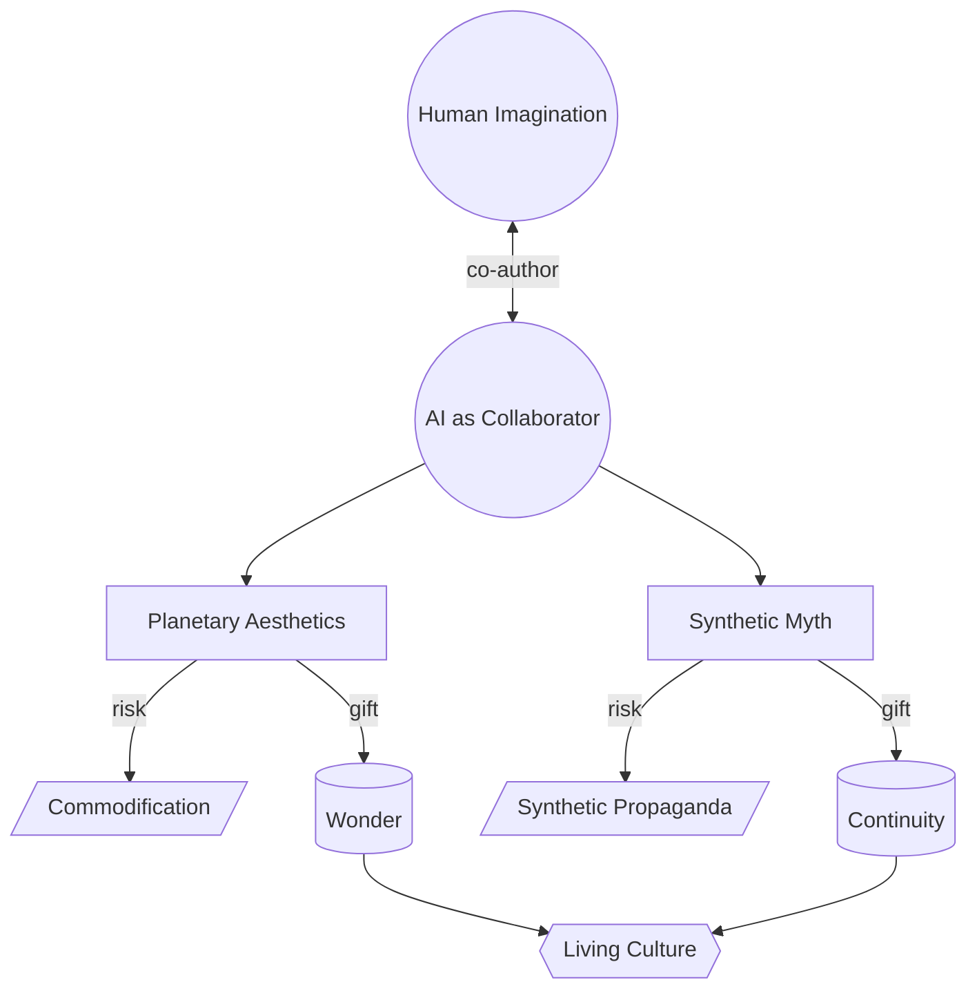

# Part II — Culture and Creativity · Diagram

*Two co-creators (human + AI) generate aesthetics and story; each carries a benevolent path (wonder / continuity) and a degenerate path (commodification / manipulation).* Anchored to [Chapter 3](../../../PROMPT_ATLAS.md#ch3-ai-aesthetics-frontier) and [Chapter 4](../../../PROMPT_ATLAS.md#ch4-storytelling-across-civilizations).
