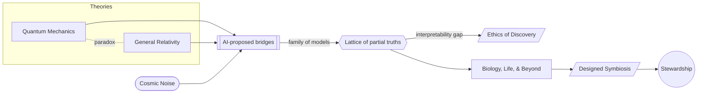

# Part III — Science and Discovery · Diagram

*From the QM/GR paradox through AI-built bridges to a lattice of partial models, then on to designed biology and the stewardship it demands.* Anchored to [Chapter 5](../../../PROMPT_ATLAS.md#ch5-quantum-bridges-and-cosmic-noise) and [Chapter 6](../../../PROMPT_ATLAS.md#ch6-biology-life-and-beyond). Repo touch-points: [`losses_geom.py`](../../../src/losses_geom.py), [`z3_tester.py`](../../../src/testers/z3_tester.py).
