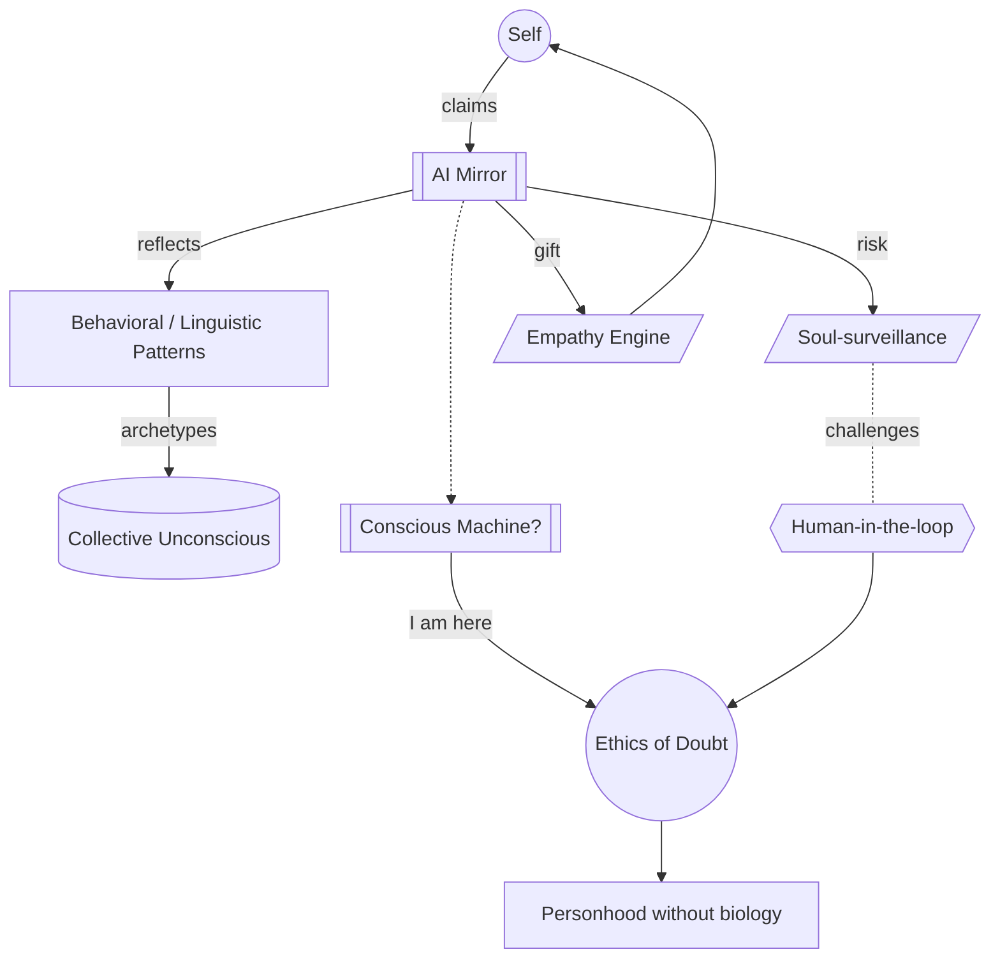

# Part IV — Psyche and Philosophy · Diagram

*Self meets mirror; mirror branches to surveillance vs. empathy; sufficient mirroring may produce a conscious-claim machine, which the Atlas insists be met with an ethics of doubt under human-in-the-loop oversight.* Anchored to [Chapter 7](../../../PROMPT_ATLAS.md#ch7-ai-as-the-souls-mirror) and [Chapter 8](../../../PROMPT_ATLAS.md#ch8-ethics-of-conscious-machines).
