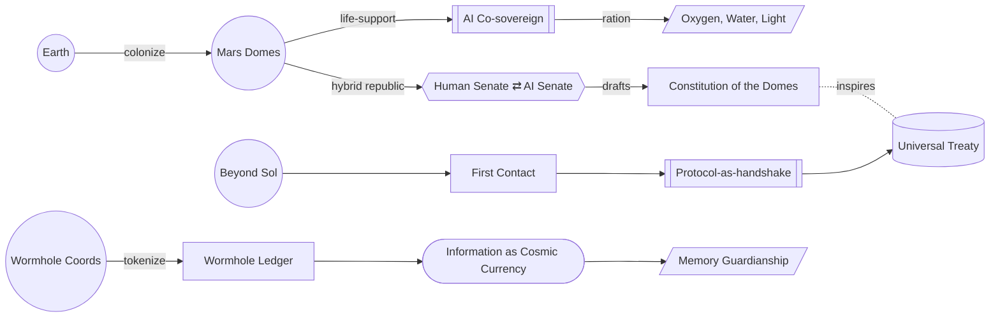

# Part V — Intergalactic Horizons · Diagram

*Mars introduces algorithmic sovereignty (AI Senate), then expansion forces first-contact protocols and a universal treaty; in parallel, scarce knowledge (wormhole coordinates, archives) becomes the dominant currency, demanding memory guardianship.* Anchored to [Chapter 9](../../../PROMPT_ATLAS.md#ch9-martian-republics-and-alien-treaties) and [Chapter 10](../../../PROMPT_ATLAS.md#ch10-information-as-cosmic-currency).
