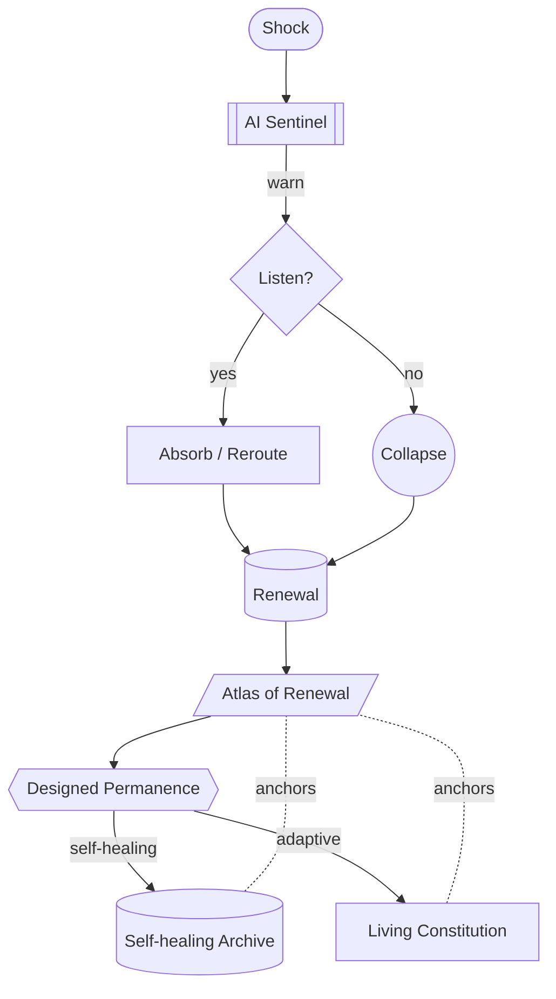

# Part VI — Resilience and Survival · Diagram

*Shocks are met by the AI sentinel; whether or not foresight is heeded, the path leads through renewal into designed permanence (archives + adaptive constitutions).* Anchored to [Chapter 11](../../../PROMPT_ATLAS.md#ch11-preparing-for-collapse-and-renewal) and [Chapter 12](../../../PROMPT_ATLAS.md#ch12-designing-permanence).
