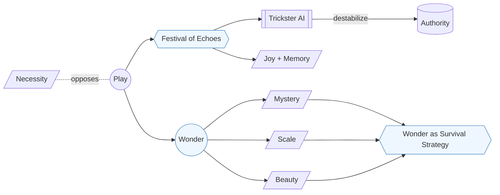

# Part VII — The Playground of Imagination · Diagram

*Carnival and wonder as twin practices; both treat play and awe not as luxuries but as load-bearing infrastructure of civilization.* Anchored to [Chapter 13](../../../PROMPT_ATLAS.md#ch13-carnival-of-prompts) and [Chapter 14](../../../PROMPT_ATLAS.md#ch14-wonder-as-survival-strategy).
